# Demos and samples for Building an AWS Solutions Architect agent with Amazon Bedrock (Berlin Summit BOA305)

This repository is complementary to breakout session on "Building an AWS Solutions Architect agent with Amazon Bedrock" at the [AWS Berlin Summit 2024](https://aws.amazon.com/events/summits/emea/berlin/)

🎥 Watch the session [here](https://bit.ly/boa305-berlin)

[](https://www.youtube.com/watch?v=8ftKjZyaqNk "BOA305")

Welcome to this repository on building Generative AI Agents using Amazon Bedrock!

This repo includes tutorial for the following solutions:

1. Tool 1- Q&A ChatBot utilizing Knowledge Bases for Amazon Bedrock
2. Tool 2- Explain diagrams and generate IaC using multimodal LLM (Claude 3)
3. Tool 3 - Estimate Cost using InfraCost
4. Configure AI Agent using Amazon Bedrock

By the end of this tutorial, you will learn how to create an Amazon Bedrock Agent that can assist with querying the AWS documentation, suggest and explain AWS solutions, generate Infrastructure as Code (IaC), and estimate monthly cost to run a solution on AWS.

<div align="center">
    
</div>

Prerequisites:

- Basic Python coding skills
- Experience with AWS Console
- Familiarity with core AWS services (Lambda, IAM, )

## Prerequisite Steps

This workshop assumes you are working in an environment with access to [Python 3.9](https://www.python.org/getit/) and [Docker](https://www.docker.com/)

1. **Clone the Repository:** Start by cloning the provided repository which contains the code for our agent.

```bash
git clone https://github.com/viktoriasemaan/ai-agents.git
cd ai-agents
```

2. **Install Dependencies:** Run the appropriate pip install command to download necessary packages.

``` bash
pip install -r requirements.txt
```

## Tool 1- Q&A ChatBot utilizing Knowledge Bases for Amazon Bedrock

This tool aims to demonstrate how quickly a Knowledge Base or Retrieval Augmented Generation (RAG) system can be created. It enriches standard user requests with new information uploaded to the knowledge base.

In our case, we will upload the latest published AWS whitepapers and references architecture diagrams to the knowledge base. This will allow the tool to provide answers as a solution architect by retrieving relevant information from the documentation.

RAG optimizes the output of a large language model by referencing an authoritative knowledge base. It compares embeddings of user queries to the knowledge library vector, appending the original prompt with relevant information to generate an informed response.

<div align="center">
    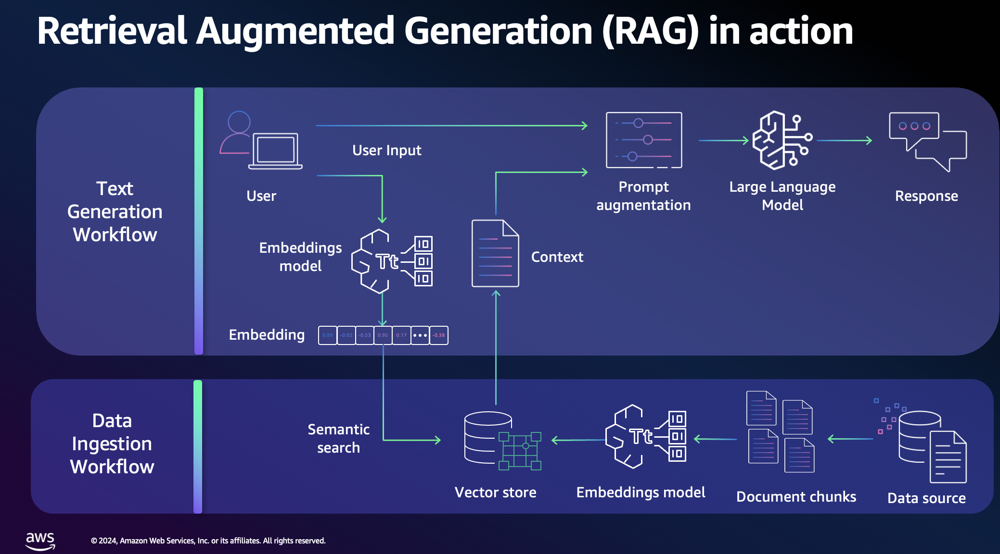
</div>

#### 1. Download Reference Architecture Diagrams

First, download the latest reference architecture diagrams from [AWS Reference Architecture Diagrams](https://aws.amazon.com/architecture/reference-architecture-diagrams) and upload them to your S3 bucket named `knowledge-base-bedrock-agent`.

#### 2. Create a Knowledge Base on Bedrock

Navigate to the Amazon Bedrock service. Under Builder Tools, select Knowledge Bases and create a new one.

#### 3. Configure Permissions

During the configuration, you need to set permissions for the job. This includes access to S3 and other services.

#### 4. Choose Data Source

Select your data source. Options include:

- S3 bucket (our case)
- Web Crawler
- Confluence
- Salesforce
- SharePoint

<div align="center">
    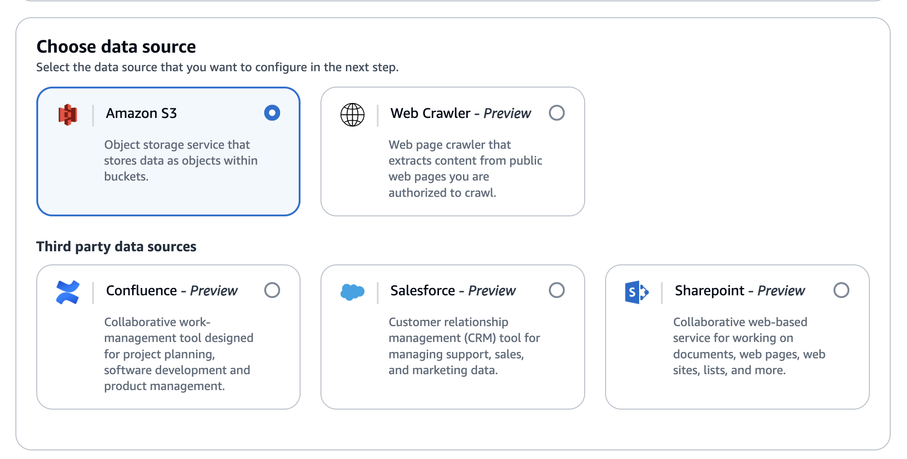
</div>

#### 5. Define S3 Document Location

Specify the location of your documents in the S3 bucket.

#### 6. Select Embeddings Model and Configure Vector Store

Choose the embedding model. Options include Amazon's Titan or Cohere. For our demo, we'll use Titan for embedding and OpenSearch as the vector store.
<div align="center">
    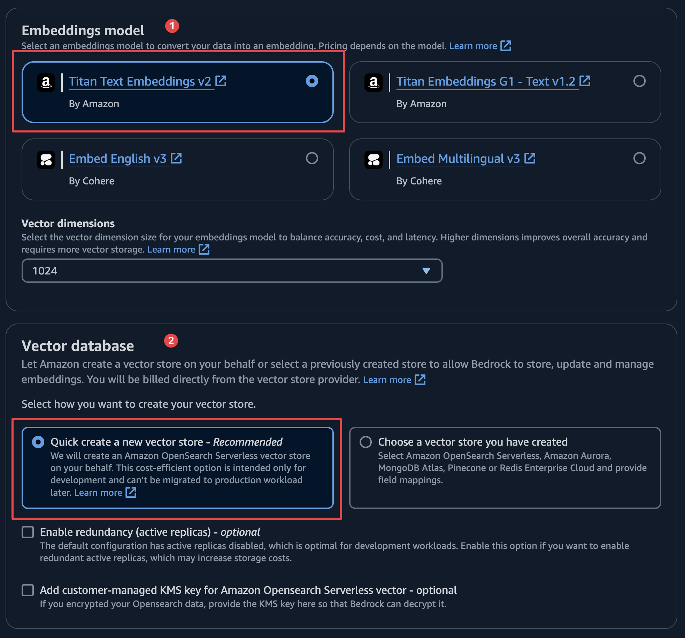
</div>

#### 7. Review Configuration

Review all your configurations and wait a few minutes for the setup to complete.

#### 8. Test Your Knowledge Base

Extend the configuration window to set up your chat and select the model (Claude 3 Sonnet).

#### 9. Adjust Prompt Template

In the "Knowledge Base Prompt Template" section, adjust the prompt to act as an AWS Solution Architect.

<div align="center">
    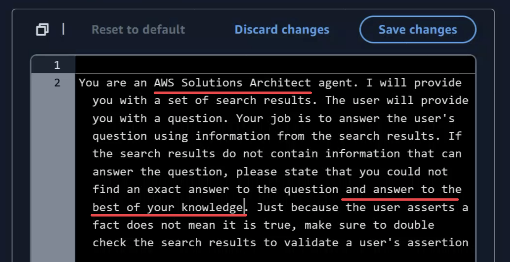
</div>

#### 10. Test the Knowledge Base

Test your knowledge base with the question: "Tell me about zero-ETL with Aura and Redshift?" You should receive a response with references to the information sources.

<div align="center">
    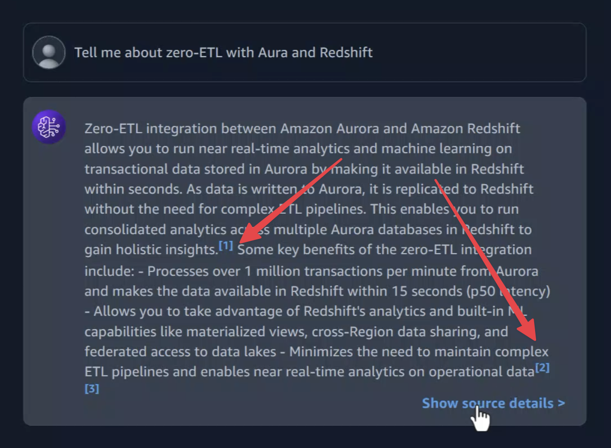
</div>

#### 11. Working with the Knowledge Base through the Agent

To work with the Knowledge Base using the agent, we need to get context from the user. The `get_contexts` function helps us with this by calling the foundation model with additional context, which is our knowledge base. This is implemented in the `answer_query` function.
To test this functionality, use the `test_tools.py` file. Uncomment the section `test answer_query` to run the test.

This tool, SA Q&A, helps quickly find information not available in the default foundation model. For example, it can provide the latest details on zero-ETL with Aurora and RedShift. The next step is to assist with big architecture diagrams and generate Infrastructure as Code (IaC) for the MVP.

## Tool 2- Explain diagrams and generate IaC using multimodal LLM (Claude 3)

Out next tool will help us to generate IaC code when we need to MPV, but before we jump in to IaC generation. Claude 3 has good capacilities with analizing images, so we can use it to help us understand what's going on the architecture diagram and explain it.

### Explain Diagrams and Test Different Models

#### 1. Open Chat Playground

To test any foundation model, you can use the chat playground. When you open the playground, first select the model. We need to choose Claude 3 Sonnet.

#### 2. Open Another Model on the Same Playground

Our goal is to compare Claude 3 Sonnet with Claude 3 Haiku. So, select Claude 3 Haiku on the other side of the playground.

<div align="center">
    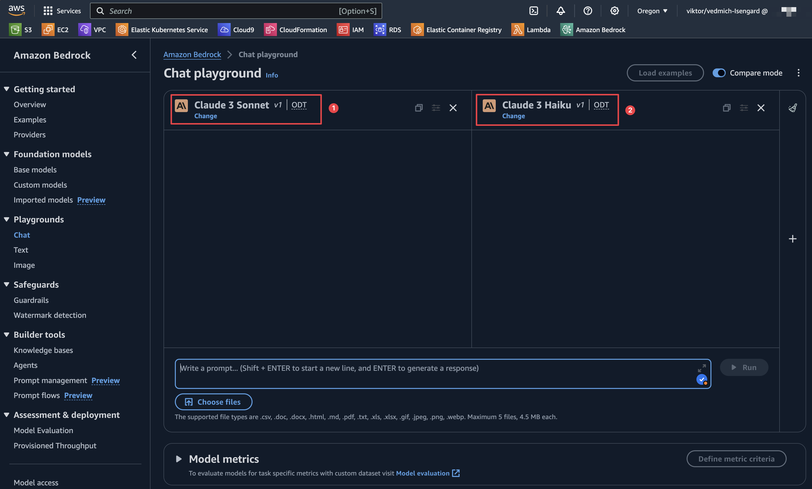
</div>

#### 3. Upload Image and Define the Prompt

Now, you can upload any architecture diagram. We will use a legacy version of an e-commerce application. This will add an additional challenge for our comparison.

<div align="center">
    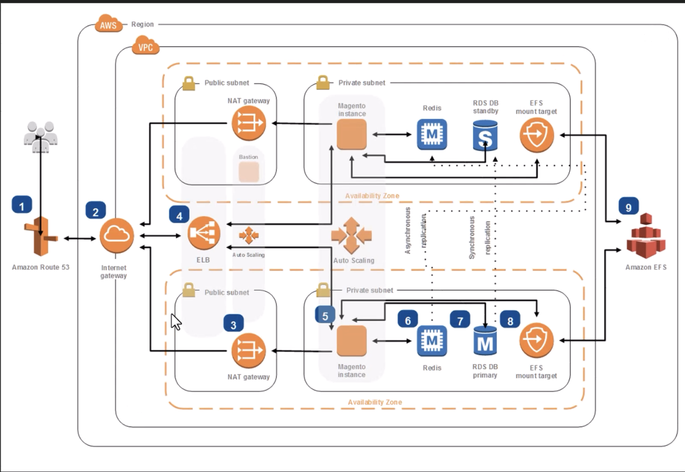
</div>

#### 4. Compare Results

As a result, we can compare the metrics from both models and also the responses from the models.

<div align="center">
    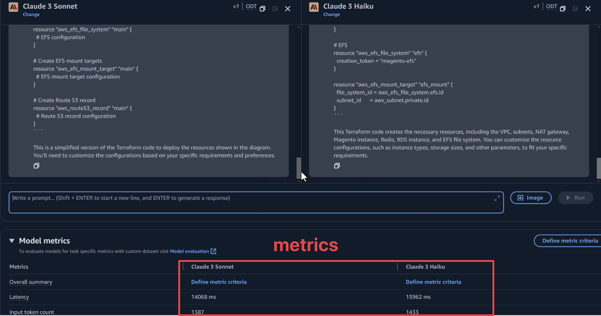
</div>

Based on this comparison, we will see that in our case, Cloud 3 Heiko works very well, and from the price perspective, it will be much cheaper. So depending on the use cases, we need to make the right selection of the FM.

### Generate IaC

Now that we understand the architecture diagram, we need to generate Terraform code (IaC) to test our idea. In most cases, a solution architect should be able to provide part of the IaC for MVP and test purposes. It's a good time to add this to our SA Agent.

#### 1. Prepare the Right Prompt for `iac_gen_tool` Function

The first step is to prepare a good prompt to generate the code.

```txt
Generates Infrastructure as Code (IaC) scripts based on a customer's request.

    Args:
        prompt (str): The customer's request.

    Returns:
        str: The S3 path where the generated IaC code is saved.
```

#### 2. Finilizing of the prompt

From the first step, we prepared the prompt with args from the end user input. But we also need to add a specific ending to the prompt to ensure the FM does exactly what we want.

```txt
prompt_ending = "Act as a DevOps Engineer. Carefully analyze the customer requirements provided and identify all AWS services and integrations needed for the solution. Generate the Terraform code required to provision and configure each AWS service, writing the code step-by-step. Provide only the final Terraform code, without any additional comments, explanations, markdown formatting, or special symbols."
```

For that reason we added `prompt_ending` variable which we will add to the final prompt to FM.

#### 3. Storing the result on S3

Most usually we need to store somewhere Terraform code. For that reason we difined S3 bucket, where we want to store the code, the same code we will use to estimate cost of the infrastcuture. Detail implementation how to work with S3 you will find on the function  `iac_gen_tool`.

<div align="center">
    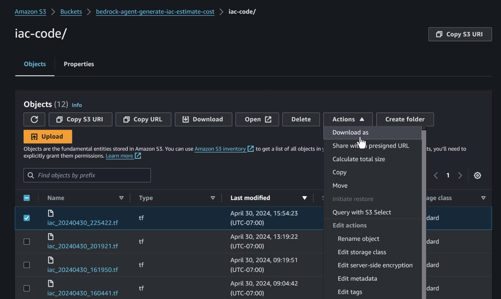
</div>

## Tool 3 - Estimate Cost using InfraCost

In the previous step, we created the code for our future infrastructure. For a solution architect, it's crucial to estimate the approximate cost of the infrastructure for the customer. In this step, we will integrate [infracost](https://github.com/infracost/infracost) into our SA agent as the third tool.

### 1. Prepare Docker image

InfraCost can be distributed as a binary file, which you can install on your local machine, or you can add it to your Docker application. We will go with the Docker option since the next step involves running the Docker file as a Lambda function.

In our Dockerfile, we specify the version of InfraCost to use:

```Dockerfile
FROM infracost/infracost:ci-latest as infracost
```

Next, we copy the required files:

```
COPY --from=infracost /usr/bin/infracost /app/
```

You can find the complete Dockerfile in this repository.

### 2. Prepare Prompt for Infrastructure Cost Estimation

Just like the previous step, defining a good prompt is crucial, especially for mathematical calculations.

```txt
For services with multiple line items (e.g., RDS), aggregate the costs into a single total for that service. Present the cost analysis as a list, with each service and its corresponding monthly cost. Finally, include the total monthly cost for the entire infrastructure.
```

This prompt helps to avoid calculation mistakes and aggregate costs for all services.

### 3. Get Local Version of Terraform Code

In Tool #2, we generated the Terraform code and stored it on S3. Now, we need to copy the code locally and run InfraCost against it to get the results.

```python
local_file_path = os.path.join(local_dir, os.path.basename(latest_file_key))
    s3.download_file(bucket_name, latest_file_key, local_file_path)
    
```

### 4. Run InfraCost

With our code now local, it's time to run InfraCost.

```python
infracost_cmd = f"infracost breakdown --path /tmp/infracost-evaluate > {cost_file_path}"
    try:
        subprocess.run(infracost_cmd, shell=True, check=True)
    except subprocess.CalledProcessError as e:
        # Read the result file even if the command returns a non-zero exit code
        with open(cost_file_path, 'r') as f:
            cost_file = f.read()
        print(f"Infracost command returned non-zero exit code: {e.returncode}")
        print(f"Result: {cost_file}")
    else:
        with open(cost_file_path, 'r') as f:
            cost_file = f.read()
        print(f"Result: {cost_file}")
```

<div align="center">
    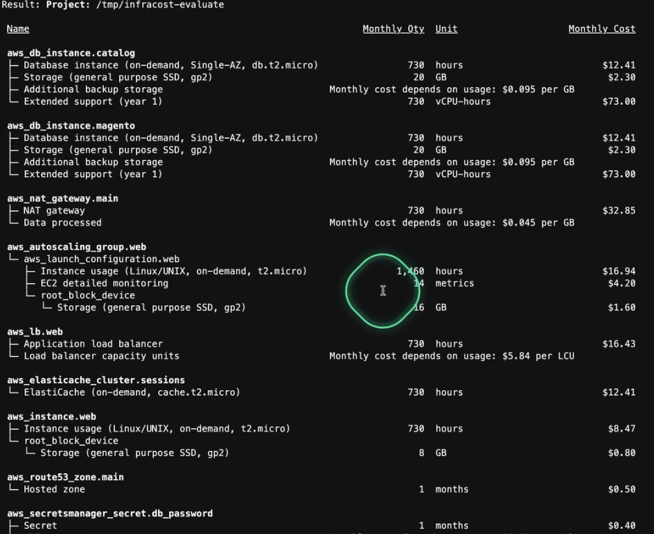
</div>


### 5. Store the Result on S3

For traceability and future use, we will store the result in an S3 bucket under the subfolder iac-cost.

### 6. Send the result to FM

Now, we can send the InfraCost output to FM (e.g., Claude) to evaluate the cost and analyze the output.

```python
generated_text = call_claude_sonnet(cost_file + prompt + prompt_ending)
```

As a result, we see the breakdown of all services and the total cost:


<div align="center">
    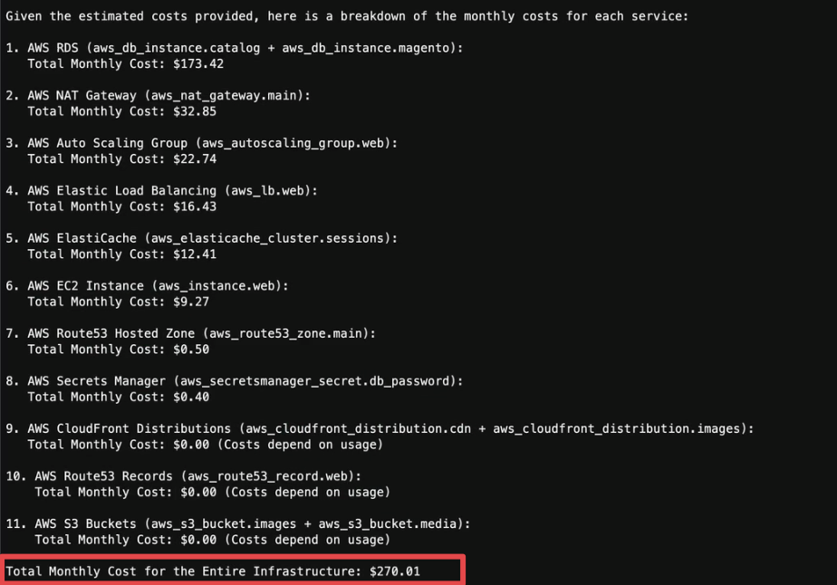
</div>

We have now configured all tools for our agent and are ready to combine them into one unified agent.

## Configure AI Agent using Amazon Bedrock

### 1. Prepare Docker file

### 2. Build and Upload Docker file to ECR

Auth to ECR 
Build process of Docker

### 3. Prepare API file with new methods 

### 4. Index.py will call seperate tool 

### 5. Deploy Lambda 

Lambda configuration memory, timeout

### 6. Permission and roles 

   ```json
   {
    "Version": "2012-10-17",
    "Statement": [
        {
            "Sid": "VisualEditor0",
            "Effect": "Allow",
            "Action": "bedrock:InvokeModel",
            "Resource": [
                "arn:aws:bedrock:*::foundation-model/*"
                ]
            }
        ]
    }
   ```

   S3 
Create one policie named for example Bedrock-S3-GetObject

    ```json
    {
        "Version": "2012-10-17",
        "Statement": [
            {
                "Sid": "VisualEditor0",
                "Effect": "Allow",
                "Action": "s3:GetObject",
                "Resource": "arn:aws:s3:::bedrockreinvent/agent_aws_openapi.json"
            }
        ]
    }
    ```

Policy to call from bedrock the lambda 


### 6. Lambda store Env variable infracost 

### 7. Create Agent on Bedrock 

FM version 
ROLE!!
Pmompt with role 
KB
Action group - lambda 

### 8. Action group 

Lambda
OpenAPI schema 

### 9. Test our agent - generate code and estimate 

Show trace


### Create the IAM roles

1. In your console, go to your [IAM Dashboard](https://us-east-1.console.aws.amazon.com/iam/).
2. Go to Policies in the right-hand side menu.
3. Create one policie named for example Bedrock-InvokeModel-Policy


4. 

5. Create a role named AmazonBedrockExecutionRoleForAgents_workshop and attach the two policies we just created previously.

To get started with the agent, open the Bedrock console, select Agents in the left navigation panel, then choose Create Agent.


This starts the agent creation workflow.

1. Provide agent details including agent name, description, whether the agent is allowed to request additional user inputs, and choose the IAM role created earlier.

Here is what I used for this Agent

```
Agent-AWS

Agent AWS is an automated, AI-powered agent that helps customers with knowledge of AWS by querying the AWS Well-Architected Framework and writing code.
```


2. Select a foundation model from Bedrock that fits your use case. Here, you provide an instruction to your agent in natural language. The instruction tells the agent what task it’s supposed to perform and the persona it’s supposed to assume. For example, “You are an expert AWS Certified Solutions Architect. Your role is to help customers understand best practices on building on AWS.”


3. Skip the Add Action Groups and create an Agent.


4. Now you can test your agent, but you won’t find it very helpful at the moment if you ask it AWS related questions such as "How can I design secure VPCs?"


This is where we have to develop "tools" for the agent which are orchestrated through the action groups.

## Building Agent Tools

Tools are self-contained functions designed to perform a specific task. In `tools.py` we have two functions we are going to provide to our agent `aws_well_arch_tool` and `code_gen_tool`.

### Querying the AWS Well-Architected Framework

The code for this tool uses [Langchain](https://python.langchain.com/docs/get_started/introduction.html) a popular framework for developing applications powered by large language models. Langchain provides an interface to use Bedrock Embeddings with a [local vector database](https://github.com/facebookresearch/faiss) to retrieve documents relevant to a user's query. Using the documents, we can then send a request to the Titan model using Bedrock to get a response back with relevant context. this is known as [Retrieval Augmented Generation (RAG)](https://docs.aws.amazon.com/sagemaker/latest/dg/jumpstart-foundation-models-customize-rag.html).

To learn more about how the data was collected and embeddings read this [blog post](https://community.aws/posts/well-arch-chatbot#data-collection)

The code used to collect the data is in `ingest.py`

### Code Generation Tool

The code for this tool, uses a call to the Claude-V2 model to generate code based on a user's request.

### Testing tools

To test the tools, you can run

```bash
python test_tools.py
```

You should get output similar to this

```
 AWS provides a set of best practices for designing secure VPCs. These best practices include creating network layers, controlling traffic at all layers, automating network protection, implementing inspection and protection, and considering whether resources need to be in public subnets.
 Here is some documentation for more details: 
https://docs.aws.amazon.com/wellarchitected/latest/security-pillar/protecting-networks.html
https://docs.aws.amazon.com/wellarchitected/latest/security-pillar/sec_network_protection_create_layers.html
https://docs.aws.amazon.com/wellarchitected/latest/framework/sec_network_protection_create_layers.html
https://docs.aws.amazon.com/wellarchitected/latest/framework/sec_network_protection_create_layers.html
```

```python
import boto3

def upload_file_to_s3(file_name, bucket, object_name=None):
    """Upload a file to an S3 bucket
    
    Args:
        file_name (str): File to upload
        bucket (str): Bucket to upload to
        object_name (str): S3 object name. If not specified then file_name is used
    """
    
    # If S3 object_name was not specified, use file_name
    if object_name is None:
        object_name = file_name

    # Upload the file    
    s3_client = boto3.client('s3')
    s3_client.upload_file(file_name, bucket, object_name)
...    
```

Feel free to play around with the prompts by editing `test_tools.py`

## Building the Lambda Function

For our Agent to use our tools, we must encapsulate the logic into a lambda function. `index.py` has the logic to parse a request from the agent, and then pick the correct tool to use. The function will then format the response and send it back to the agent.

### Push Docker Image to ECR

We will package this Lambda function as a container, so create a new ECR following these [instructions](https://docs.aws.amazon.com/AmazonECR/latest/userguide/repository-create.html). I called mine `bedrock_sa_tools`


Once the repo is created, follow the instructions in the `View push commands` button to upload the Docker Image to ECR.

### Create the Lambda Function

1. Navigate to the [Lambda Console](https://us-east-1.console.aws.amazon.com/lambda/home?region=us-east-1#/functions) and click on `Create function` button.

2. Chose Container image then provide the `Function name` (berdock_sa_tools) and for the `Container image URI` select the container you uploaded.

3. Click on Create function button in the bottom of the page

### Update Lambda Permissions

1. Once the function is created, click on the Configuration Tab in the same page and `Choose Permissions` from the left side panel

2. Click on Add permissions button in Resource-based policy statement section to provide the permission to invoke lambda functions from bedrock


3. Provide Statement Id as `agent` , Principal as `bedrock.amazonaws.com` and Action as `lambda:InvokeFunction`. Click Save after adding all the above three information.


4. Add the following Policy Statement to your Execution role, so Lambda can call Bedrock. (Details [here](https://docs.aws.amazon.com/IAM/latest/UserGuide/access_policies_manage-attach-detach.html#add-policies-console))

```json
{
    "Version": "2012-10-17",
    "Statement": [
        {
            "Sid": "VisualEditor0",
            "Effect": "Allow",
            "Action": "bedrock:InvokeModel",
            "Resource": "*"
        }
    ]
}
```

### Testing Lambda Function

To test your Lambda function:

1. Click on the "Test" tab near the top of the page.

2. Configure a test event that matches how the Agent will send a request:

```
{
  "agent": {
    "alias": "TSTALIASID",
    "name": "Agent-AWS",
    "version": "DRAFT",
    "id": "KQI6ICMKZZ"
  },
  "sessionId": "975786472213626",
  "httpMethod": "GET",
  "sessionAttributes": {},
  "inputText": "How can I create secure VPCs?",
  "promptSessionAttributes": {},
  "apiPath": "/query_well_arch_framework",
  "messageVersion": "1.0",
  "actionGroup": "agent_action_group",
  "parameters": [
    {
      "name": "query",
      "type": "string",
      "value": "How can I create secure VPCs?"
    }
  ]
}
```

3. Click on "Test" to execute the Lambda function. You should see the results of the function invocation, which will be a response from the Titan Model.


## Upload OpenAPI Spec

The [OpenAPI Specification (OAS)](https://swagger.io/specification/) defines a standard, language-agnostic interface to HTTP APIs which allows both humans and computers to discover and understand the capabilities of the service without access to source code.

Our agent will be able to understand what tool to use based on the request given to the user and then call the correct endpoint due to the OpenAPI spec.

You will need to upload the `agent_aws_openapi.json` [file to an S3 bucket](https://docs.aws.amazon.com/AmazonS3/latest/userguide/upload-objects.html).

## Create Action Group

An action is a task that the agent can perform automatically by making API calls to your company systems. A set of actions is defined in an action group. The OpenAPI schema defines the API for all the actions in the group. The agent will invoke our Lambda function based on request, that will invoke the tools we built.

1. To begin go to the Agents List Page and search for the Agent created earlier and click the Agent Name to load the agent details.

2. Click on the `Working draft` link to go into the Agent and add the agent action.

3. Click on the `Add` button in Action groups section to create a new Action Group for the agent.

4. Provide the Action Group Name and Description (Optional). Choose the Lambda function and the S3 object for the API spec uploaded earlier.


5. Click on `Save and exit` button in the right bottom of the page.

6. Once the Agent Status is in `Ready` state in Agent home page. You can start the testing.

## Play Time

Now the agent will be much more helpful than it was prior to adding an action group


Try out some different prompts, and test the limits of the agent. Happy building!

## Security

See [CONTRIBUTING](CONTRIBUTING.md#security-issue-notifications) for more information.

## License

This library is licensed under the MIT-0 License. See the LICENSE file.
