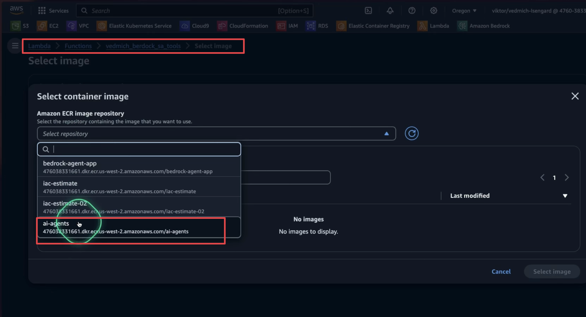
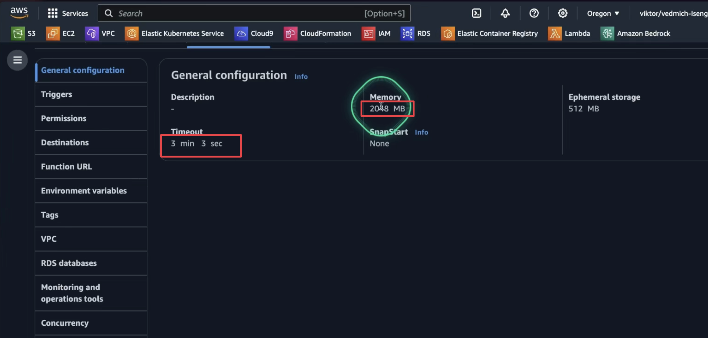
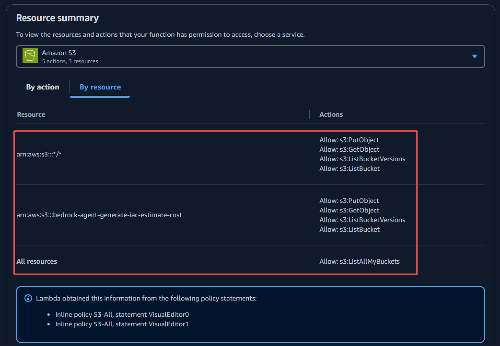
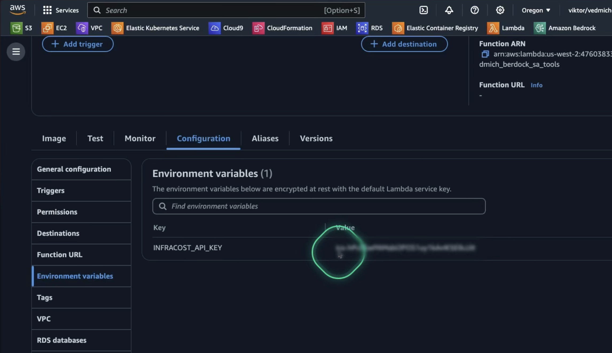
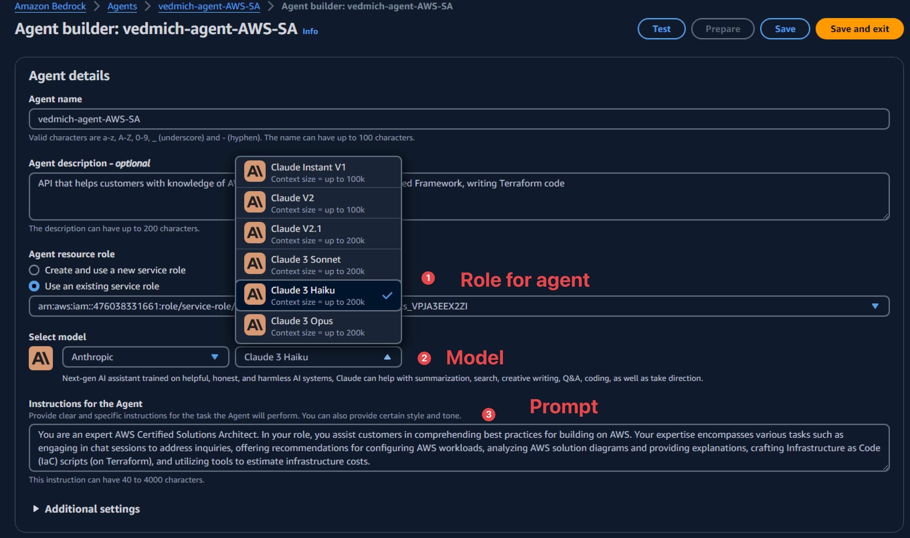
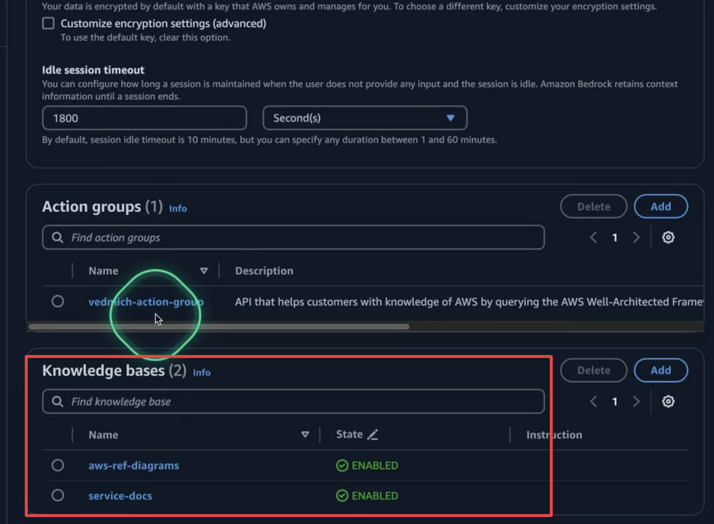
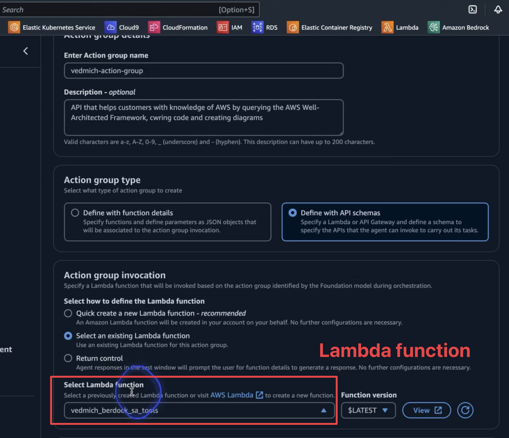
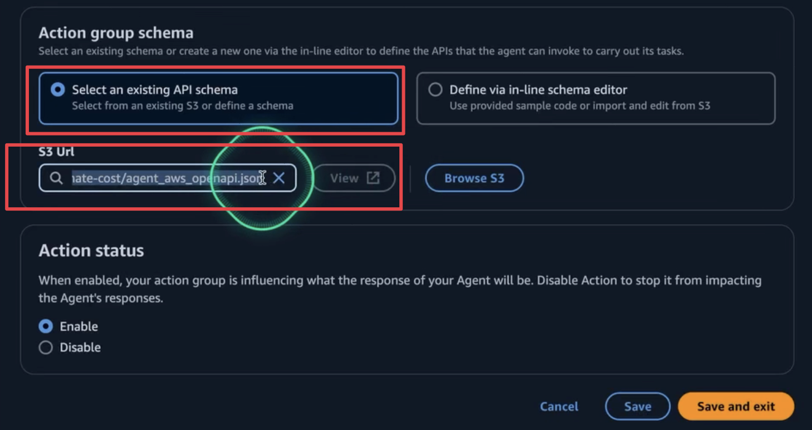
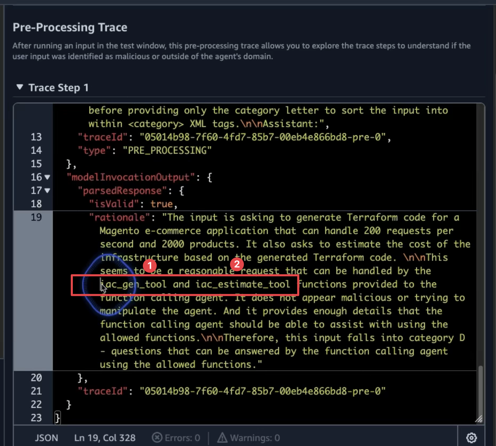
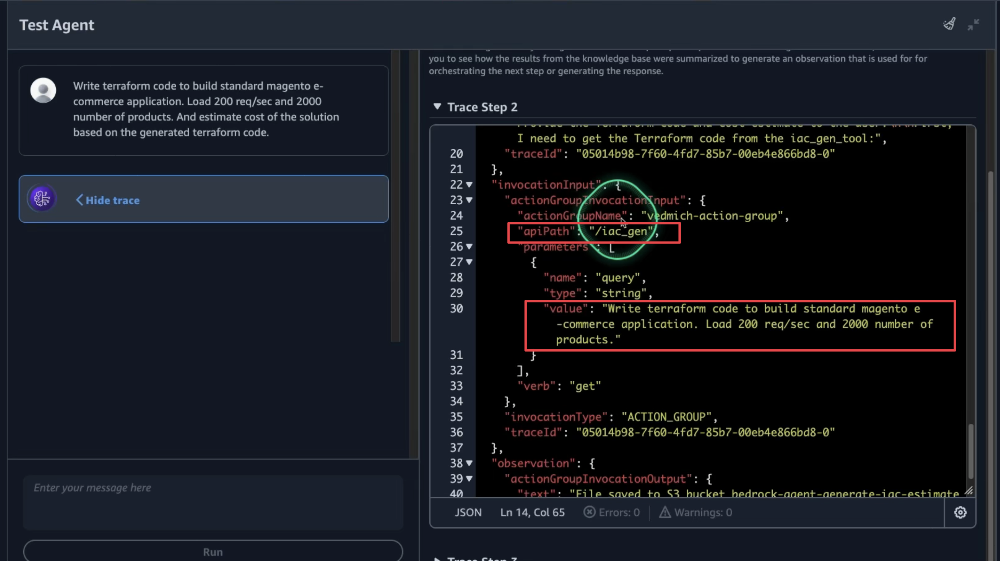

# Demos and samples for Building an AWS Solutions Architect agent with Amazon Bedrock (Berlin Summit BOA305)

This repository is complementary to breakout session on "Building an AWS Solutions Architect agent with Amazon Bedrock" at the [AWS Berlin Summit 2024](https://aws.amazon.com/events/summits/emea/berlin/)

🎥 Watch the session [here](https://bit.ly/boa305-berlin)

[](https://www.youtube.com/watch?v=8ftKjZyaqNk "BOA305")

Welcome to this repository on building Generative AI Agents using Amazon Bedrock!

This repo includes tutorial for the following solutions:

1. Tool 1- Q&A ChatBot utilizing Knowledge Bases for Amazon Bedrock
2. Tool 2- Explain diagrams and generate IaC using multimodal LLM (Claude 3)
3. Tool 3 - Estimate Cost using InfraCost
4. Configure AI Agent using Amazon Bedrock

By the end of this tutorial, you will learn how to create an Amazon Bedrock Agent that can assist with querying the AWS documentation, suggest and explain AWS solutions, generate Infrastructure as Code (IaC), and estimate monthly cost to run a solution on AWS.

<div align="center">
    
</div>

Prerequisites:

- Basic Python coding skills
- Experience with AWS Console
- Familiarity with core AWS services (Lambda, IAM, )

## Prerequisite Steps

This workshop assumes you are working in an environment with access to [Python 3.9](https://www.python.org/getit/) and [Docker](https://www.docker.com/)

1. **Clone the Repository:** Start by cloning the provided repository which contains the code for our agent.

```bash
git clone https://github.com/viktoriasemaan/ai-agents.git
cd ai-agents
```

2. **Install Dependencies:** Run the appropriate pip install command to download necessary packages.

``` bash
pip install -r requirements.txt
```

## Tool 1- Q&A ChatBot utilizing Knowledge Bases for Amazon Bedrock

This tool aims to demonstrate how quickly a Knowledge Base or Retrieval Augmented Generation (RAG) system can be created. It enriches standard user requests with new information uploaded to the knowledge base.

In our case, we will upload the latest published AWS whitepapers and references architecture diagrams to the knowledge base. This will allow the tool to provide answers as a solution architect by retrieving relevant information from the documentation.

RAG optimizes the output of a large language model by referencing an authoritative knowledge base. It compares embeddings of user queries to the knowledge library vector, appending the original prompt with relevant information to generate an informed response.

<div align="center">
    
</div>

#### 1. Download Reference Architecture Diagrams

First, download the latest reference architecture diagrams from [AWS Reference Architecture Diagrams](https://aws.amazon.com/architecture/reference-architecture-diagrams) and upload them to your S3 bucket named `knowledge-base-bedrock-agent`.

#### 2. Create a Knowledge Base on Bedrock

Navigate to the Amazon Bedrock service. Under Builder Tools, select Knowledge Bases and create a new one.

#### 3. Configure Permissions

During the configuration, you need to set permissions for the job. This includes access to S3 and other services.

#### 4. Choose Data Source

Select your data source. Options include:

- S3 bucket (our case)
- Web Crawler
- Confluence
- Salesforce
- SharePoint

<div align="center">
    
</div>

#### 5. Define S3 Document Location

Specify the location of your documents in the S3 bucket.

#### 6. Select Embeddings Model and Configure Vector Store

Choose the embedding model. Options include Amazon's Titan or Cohere. For our demo, we'll use Titan for embedding and OpenSearch as the vector store.
<div align="center">
    
</div>

#### 7. Review Configuration

Review all your configurations and wait a few minutes for the setup to complete.

#### 8. Test Your Knowledge Base

Extend the configuration window to set up your chat and select the model (Claude 3 Sonnet).

#### 9. Adjust Prompt Template

In the "Knowledge Base Prompt Template" section, adjust the prompt to act as an AWS Solution Architect.

<div align="center">
    
</div>

#### 10. Test the Knowledge Base

Test your knowledge base with the question: "Tell me about zero-ETL with Aura and Redshift?" You should receive a response with references to the information sources.

<div align="center">
    
</div>

#### 11. Working with the Knowledge Base through the Agent

To work with the Knowledge Base using the agent, we need to get context from the user. The `get_contexts` function helps us with this by calling the foundation model with additional context, which is our knowledge base. This is implemented in the `answer_query` function.
To test this functionality, use the `test_tools.py` file. Uncomment the section `test answer_query` to run the test.

This tool, SA Q&A, helps quickly find information not available in the default foundation model. For example, it can provide the latest details on zero-ETL with Aurora and RedShift. The next step is to assist with big architecture diagrams and generate Infrastructure as Code (IaC) for the MVP.

## Tool 2- Explain diagrams and generate IaC using multimodal LLM (Claude 3)

Out next tool will help us to generate IaC code when we need to MPV, but before we jump in to IaC generation. Claude 3 has good capacilities with analizing images, so we can use it to help us understand what's going on the architecture diagram and explain it.

### Explain Diagrams and Test Different Models

#### 1. Open Chat Playground

To test any foundation model, you can use the chat playground. When you open the playground, first select the model. We need to choose Claude 3 Sonnet.

#### 2. Open Another Model on the Same Playground

Our goal is to compare Claude 3 Sonnet with Claude 3 Haiku. So, select Claude 3 Haiku on the other side of the playground.

<div align="center">
    
</div>

#### 3. Upload Image and Define the Prompt

Now, you can upload any architecture diagram. We will use a legacy version of an e-commerce application. This will add an additional challenge for our comparison.

<div align="center">
    
</div>

#### 4. Compare Results

As a result, we can compare the metrics from both models and also the responses from the models.

<div align="center">
    
</div>

Based on this comparison, we will see that in our case, Cloud 3 Heiko works very well, and from the price perspective, it will be much cheaper. So depending on the use cases, we need to make the right selection of the FM.

### Generate IaC

Now that we understand the architecture diagram, we need to generate Terraform code (IaC) to test our idea. In most cases, a solution architect should be able to provide part of the IaC for MVP and test purposes. It's a good time to add this to our SA Agent.

#### 1. Prepare the Right Prompt for `iac_gen_tool` Function

The first step is to prepare a good prompt to generate the code.

```txt
Generates Infrastructure as Code (IaC) scripts based on a customer's request.

    Args:
        prompt (str): The customer's request.

    Returns:
        str: The S3 path where the generated IaC code is saved.
```

#### 2. Finilizing of the prompt

From the first step, we prepared the prompt with args from the end user input. But we also need to add a specific ending to the prompt to ensure the FM does exactly what we want.

```txt
prompt_ending = "Act as a DevOps Engineer. Carefully analyze the customer requirements provided and identify all AWS services and integrations needed for the solution. Generate the Terraform code required to provision and configure each AWS service, writing the code step-by-step. Provide only the final Terraform code, without any additional comments, explanations, markdown formatting, or special symbols."
```

For that reason we added `prompt_ending` variable which we will add to the final prompt to FM.

#### 3. Storing the result on S3

Most usually we need to store somewhere Terraform code. For that reason we difined S3 bucket, where we want to store the code, the same code we will use to estimate cost of the infrastcuture. Detail implementation how to work with S3 you will find on the function  `iac_gen_tool`.

<div align="center">
    
</div>

## Tool 3 - Estimate Cost using InfraCost

In the previous step, we created the code for our future infrastructure. For a solution architect, it's crucial to estimate the approximate cost of the infrastructure for the customer. In this step, we will integrate [infracost](https://github.com/infracost/infracost) into our SA agent as the third tool.

### 1. Prepare Docker image

InfraCost can be distributed as a binary file, which you can install on your local machine, or you can add it to your Docker application. We will go with the Docker option since the next step involves running the Docker file as a Lambda function.

In our Dockerfile, we specify the version of InfraCost to use:

```Dockerfile
FROM infracost/infracost:ci-latest as infracost
```

Next, we copy the required files:

```
COPY --from=infracost /usr/bin/infracost /app/
```

You can find the complete Dockerfile in this repository.

### 2. Prepare Prompt for Infrastructure Cost Estimation

Just like the previous step, defining a good prompt is crucial, especially for mathematical calculations.

```txt
For services with multiple line items (e.g., RDS), aggregate the costs into a single total for that service. Present the cost analysis as a list, with each service and its corresponding monthly cost. Finally, include the total monthly cost for the entire infrastructure.
```

This prompt helps to avoid calculation mistakes and aggregate costs for all services.

### 3. Get Local Version of Terraform Code

In Tool #2, we generated the Terraform code and stored it on S3. Now, we need to copy the code locally and run InfraCost against it to get the results.

```python
local_file_path = os.path.join(local_dir, os.path.basename(latest_file_key))
    s3.download_file(bucket_name, latest_file_key, local_file_path)
    
```

### 4. Run InfraCost

With our code now local, it's time to run InfraCost.

```python
infracost_cmd = f"infracost breakdown --path /tmp/infracost-evaluate > {cost_file_path}"
    try:
        subprocess.run(infracost_cmd, shell=True, check=True)
    except subprocess.CalledProcessError as e:
        # Read the result file even if the command returns a non-zero exit code
        with open(cost_file_path, 'r') as f:
            cost_file = f.read()
        print(f"Infracost command returned non-zero exit code: {e.returncode}")
        print(f"Result: {cost_file}")
    else:
        with open(cost_file_path, 'r') as f:
            cost_file = f.read()
        print(f"Result: {cost_file}")
```

<div align="center">
    
</div>

### 5. Store the Result on S3

For traceability and future use, we will store the result in an S3 bucket under the subfolder iac-cost.

### 6. Send the result to FM

Now, we can send the InfraCost output to FM (e.g., Claude) to evaluate the cost and analyze the output.

```python
generated_text = call_claude_sonnet(cost_file + prompt + prompt_ending)
```

As a result, we see the breakdown of all services and the total cost:

<div align="center">
    
</div>

We have now configured all tools for our agent and are ready to combine them into one unified agent.

## Configure AI Agent using Amazon Bedrock

### 1. Prepare Docker file

First, we need to prepare the Dockerfile. We already copied the InfraCost binary into our Dockerfile. Now, we need to add all other tools and requirements for the agent.

We will use `python:3.11` as the base image:

```txt
FROM amazon/aws-lambda-python:3.11
```

Next, copy our code into the Dockerfile:

```
COPY index.py ${LAMBDA_TASK_ROOT}
COPY tools.py ${LAMBDA_TASK_ROOT}
```

### 2. Build and Upload Docker file to ECR

The next step is to build and upload our image to ECR. To build our Docker image, use the command:

```
docker build -t ai-agents .
```

Then, authenticate with our ECR repository. We have already created the repository. Use the following command to authenticate:

```
aws ecr get-login-password --region us-west-2 | docker login --username AWS --password-stdin 123412341234.dkr.ecr.us-west-2.amazonaws.com
```

Where `123412341234` is your AWS account ID.

Next, tag the image correctly and push it to the repository:

```
docker tag ai-agents:latest 123412341234.dkr.ecr.us-west-2.amazonaws.com/ai-agents:latest
docker push 123412341234.dkr.ecr.us-west-2.amazonaws.com/ai-agents:latest
```

The image is ready, but for our agent to work correctly, we need to prepare the OpenAPI schema.

### 3. Prepare API File with New Methods

The API schema will help define each action clearly:

- Operation name
- Input parameters
- Data types
- Response details

This helps agents know when to use it, how to call it, and how to use the results. It provides a language-agnostic API definition using an industry-standard schema.

In our case, we just updated the required parameters by adding the following blocks:

- `/iac_gen`
- `/iac_estimate_tool`
- `/answer_query`

### 4. Index.py Will Call Separate Tool

The logic that determines which part of the agent needs to run is defined in the `index.py` file:

```python
if api_path == "/answer_query":
    ...
elif api_path == "/iac_gen":
    ...
elif api_path == "/iac_estimate_tool":
   ...
else:
    body = f"{action}::{api_path} is not a valid API, try another one."
    response_code = 400
```

### 5. Deploy Lambda

All parts of our agent are ready, so it's time to deploy it to our Lambda function. First, we need to define the image we prepared in step #2 for the Lambda function.

<div align="center">
    
</div>

Also, since we need to work with generative AI, we need to configure the timeout and the appropriate amount of memory for the function:

<div align="center">
    
</div>

### 6. Permissions and Roles

One of the most important parts is security and the right permissions for the Lambda function. First, we need to define the permissions that the Lambda function will need to access:

**Amazon Bedrock** permissions:

   ```json
   {
    "Version": "2012-10-17",
    "Statement": [
        {
            "Sid": "VisualEditor0",
            "Effect": "Allow",
            "Action": "bedrock:InvokeModel",
            "Resource": [
                "arn:aws:bedrock:*::foundation-model/*"
                ]
            }
        ]
    }
   ```

**Amazon S3** permissions, as we will store IaC code on Amazon S3 and need access to run estimations:

<div align="center">
    
</div>

Lastly, grant Amazon Bedrock permission to call the Lambda function:

```json
{
  "Version": "2012-10-17",
  "Id": "default",
  "Statement": [
    {
      "Sid": "agent-allow",
      "Effect": "Allow",
      "Principal": {
        "Service": "bedrock.amazonaws.com"
      },
      "Action": "lambda:InvokeFunction",
      "Resource": "arn:aws:lambda:us-west-2:123412341234:function:vedmich_berdock_sa_tools",
      "Condition": {
        "ArnLike": {
          "AWS:SourceArn": "arn:aws:bedrock:us-west-2:123412341234:agent/IUZ6246HLM"
        }
      }
    }
  ]
}
```

### 7. Lambda Store Environment Variable for InfraCost

The last configuration for our Amazon Lambda function is to provide the API key for InfraCost. We can store it in the `Environment variables` section:

<div align="center">
    
</div>

### 7. Create Agent on Bedrock

Now that we have created the Amazon Lambda function, it's time for the final step - creating the Agent. On the Amazon Bedrock console, we can create and configure Bedrock Agents. The main configuration points are:

- *Role for the agent* - permissions the agent will have on our AWS account
- *Model* - which FM we will use. In our case, it is Claude 3 Haiku
- *Prompt* - where we configure the role and main purpose of the agent


<div align="center">
    
</div>

We also configure the knowledge base for the agent:
<div align="center">
    
</div>

### 9. Action group

The Action Group on the Agent is where we configure our Lambda function.
<div align="center">
    
</div>

In the same section, we need to configure the OpenAPI schema, which we created in the previous steps. Now, we need to upload it to the S3 bucket and connect it to the agent.

<div align="center">
    
</div>

Now, we can save our agent and test it.

### 10. Test our agent - generate code and estimate

We will test our agent to generate IaC and estimate the cost. Use the following prompt to test our agent:

```Write terraform code to build standard magento e-commerce application. Load 200 req/sec and 2000 number of products. And estimate cost of the solution based on the generated terraform code.
```

When we run our agent, we can trace its actions to understand what happens next and why. For the pre-processing step, we can see that the agent will use two tools from our setup:

<div align="center">
    
</div>

For every step, the agent will log the trace prompt and the next action:

<div align="center">
    
</div>

The final result will show where the code for IaC and the cost estimation are stored:

<div align="center">
    
</div>

That's how we built our solution architect generative AI agent. It's time to try out some different prompts and test the limits of the agent. Happy building!

## Security

See [CONTRIBUTING](CONTRIBUTING.md#security-issue-notifications) for more information.

## License

This library is licensed under the MIT-0 License. See the LICENSE file.
