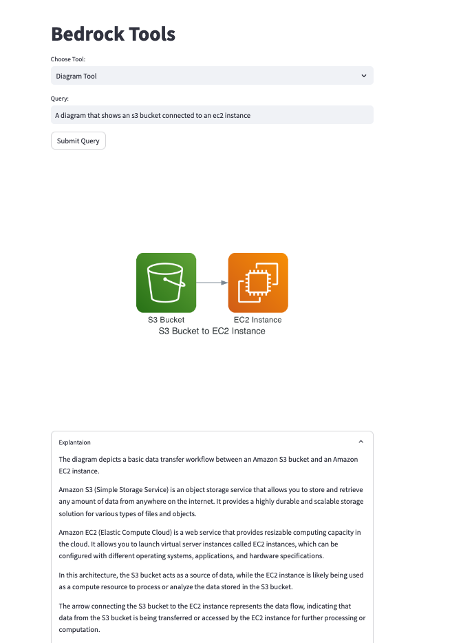

# Claude 3 Streamlit Tool Showcase

This Streamlit application showcases the capabilities of Claude 3 using three different tools: 
* AWS Well Architected Tool, 
* Diagram Tool
* Code Gen Tool

### AWS Well Architected Tool

The AWS Well Architected Tool enables users to search for answers within the AWS documentation by asking natural language questions. This tool utilizes Claude 3 to scan through the AWS documentation stored in a vector database and provides relevant information based on the user's query.

### Diagram Tool

The Diagram Tool allows users to generate diagrams related to AWS services. By providing a natural language query, Claude 3 creates code that get runs which is visual representation of the requested diagram.

### Code Gen Tool

The Code Gen Tool leverages Claude 3's capabilities to generate code snippets based on user prompts. Users can input their requirements, and Claude 3 will generate the corresponding code.

## Run the App

```
pip install -r requirements.txt
streamlit run claude3_agent_st.py
```

